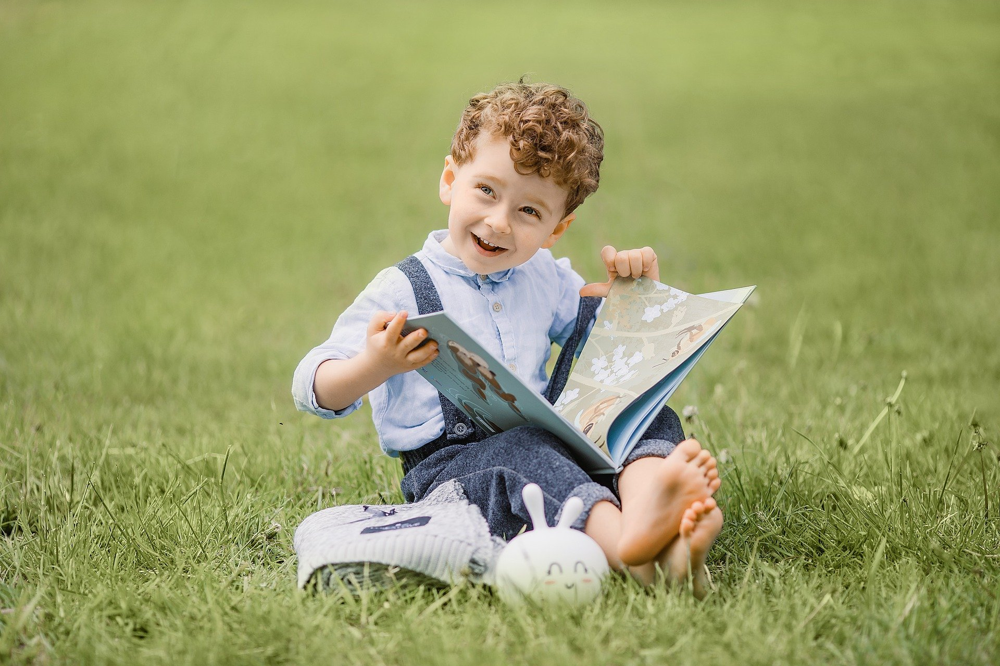

Last time, we covered two strategies for [developing better reading abilities](/blog/2-ways-get-better-readers/ "2 Simple Ways to Help Your Child Become a Better Reader"). Those who adhere to a **Charlotte Mason** philosophy are very familiar with them: narration and copywork. 

Today we're going to dig deeper into improving the comprehension processes that we use as our building blocks of narration.

I've included a few examples from Beatrix Potter's **The Tale of Peter Rabbit** and **The Tale of Benjamin Bunny**. Benjamin Bunny's story is a sequel to Peter's book. You can analyze them together to help children have a better understanding of this universe Potter created.

## Literary knowledge

The first issue that hinders poor readers is literary knowledge, or its lack.

When listeners are familiar with the literary form of the text — genre etc — they can remember and understand more.

For example, what can you tell from the sentence “**Once upon a time there were four little Rabbits, and their names were-Flopsy, Mopsy, Cotton-tail, and Peter**”? 

We are all familiar with the opening line of “**Once upon a time...**” and understand that a story, usually a fairy tale, is coming. If you've read enough fairy tales, you are also aware that there's usually the opening, the main conflict, a moral lesson, and the happy ending... This knowledge can help you summarize Peter's tale more easily.

Before storytime, help students identify **literary markers** and see the big picture. Tell them what to expect, so they can practice identifying each section of the story.

## Model manipulation

Having the students use [storyboard play](https://shopgentleclassical.com/products/storyboard-pack-for-g-c-preschool-level-2-digital?_pos=1&_psq=storyboard&_ss=e&_v=1.0?smile_referral_code=PFdZVYkd&st_intent=st%3Areferrals%3Acustomer-offers%3APFdZVYkd&utm_campaign=smileio_referrals&utm_medium=referral_url) for narration is also extremely useful. It's a fun way to monitor how well students have understood part of the story. 

Young children, especially, benefit from this strategy. It's not overwhelming or demanding. Play-based narration gives them the opportunity to order events in their minds, and to organize their thinking.  

And it also helps them make inferences to process the rest of the story. If your bunny is still inside the garden, and the next part of the story tells you he entered a shed, we should place this shed inside the garden as well. If you also hear about a pond, you may then think: “**How big is this garden, anyway?**”

## Logical reasoning

You should model good reasoning out loud to your children. Let them in on how you think things through. This will develop and sharpen their mental capacities. When it's their turn, they'll know the steps to take to analyze the text by themselves. This brings me to four main skills that should be focused on.

### Inference

“There had been rain during the night; there was water in the shoes, and the coat was somewhat shrunk.”

Ask “**Why did the coat shrink?**” Does your beginning reader know that certain clothes and fabric shrink when wet — especially ones that were handmade?

“Little Benjamin said, 'It spoils people's clothes to squeeze under a gate; the proper way to get in, is to climb down a pear tree.' ”

Why does Benjamin say that? Is it, maybe, a reference to how Peter got into the garden the last time he was there? Help your kids see the possible connection.

#### How about some practice?

“Little Benjamin sat down beside his cousin, and assured him that Mr. McGregor had gone out in a gig, and Mrs. McGregor also; because she was wearing her best bonnet.  Peter said he hoped that it would rain.”

Ask “**Why do you think Peter said that? Do you know what is a gig** — and no, it's not related to musicians...**?**”

### Marker words

“Peter fell down head first; but it was of no consequence, as the bed below was newly raked and quite soft.”

If you hear the word “**but**”, you know an opposing idea usually follows, while “**as**” suggests an explanation. What about your students? Give examples to your kids. Use your tone of voice while reading to **emphasize** those transitions.

#### More practice

“Peter scuttered underneath the bushes. But presently, as nothing happened, he came out, and climbed upon a wheelbarrow, and peeped over. The first thing he saw was Mr. McGregor hoeing onions. His back was turned towards Peter, and beyond him was the gate!”

Ask: “What does '**presently**' represents?” and “Why does the text say '**the first thing he saw**'? Did he see something else?”

### Anaphora

“Peter got down very quietly off the wheelbarrow, and started running as fast as he could go, along a straight walk behind some black-currant bushes.  Mr. McGregor caught sight of him at the corner, but Peter did not care. He slipped underneath the gate, and was safe at last in the wood outside the garden.”

Who slipped under the gate? To most good readers, it seems clear that “**he**” refers to Peter. But to poor readers, the **anaphora** might not be that obvious. We need to **explicitly** instruct readers and provide plenty of practice. That way we can help beginners figure out to which words or phrases the pronouns are referring.

#### Even more practice

“Peter scuttered underneath the bushes. But presently, as nothing happened, he came out, and climbed upon a wheelbarrow, and peeped over. The first thing he saw was Mr. McGregor hoeing onions. His back was turned towards Peter, and beyond him was the gate!”

Ask “**beyond whom was the gate? Why?**”

### Comprehension monitoring

Don't assume understanding. Gently **ask** questions and **prompt** your student to pay attention to the clues. That's called comprehension monitoring and needs to be learned. Most poor readers **don't even notice** they didn't understand the text in the first place.

## Practice?

Merely reading to children won't magically turn them into good readers, just as playing an instrument to someone won't turn one into a virtuoso. Both require **teaching** and the **development of skills**.

**Enjoy reading time and spend it wisely!**