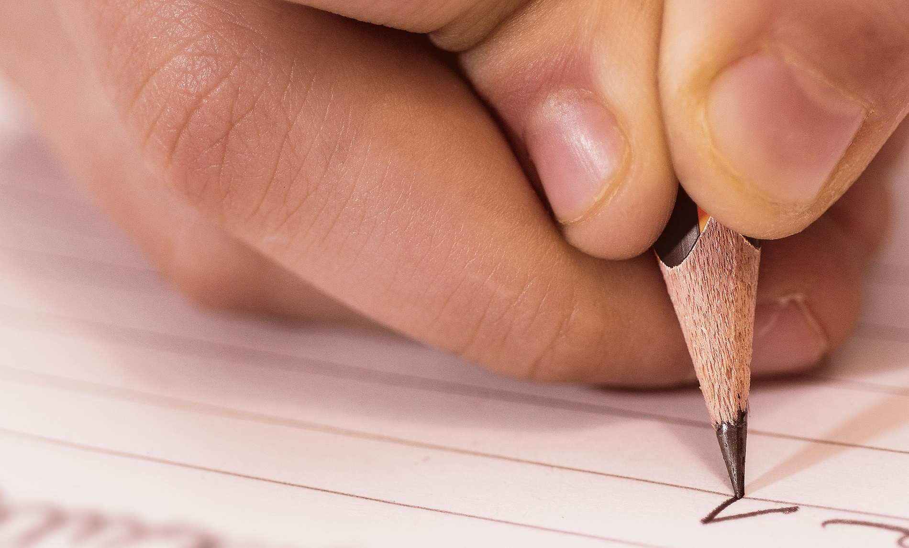

## What is tracing?

Letter formation includes certain **strokes** that are **fundamental** for good handwriting. A child must master these to do well at writing.

In *Home Education*, **Miss Mason** has excellent advice on how to teach beginning writers:

“Set him six strokes to copy; let him, not bring a slateful, but six perfect strokes, at regular distances and at regular slopes. If he produces a faulty pair, get him to point out the fault, and persevere until he has produced his task; if he does not do it to-day, let him go on to-morrow and the next day, and when the six perfect strokes appear, let it be an occasion of triumph.”

## Practice, practice

I will go on and say that we should also **experiment** with different writing utensils: test colored pencils, crayons⁠—small ones are great for practicing a good grip⁠—, markers… Go crazy and pull out some oil pastels and chalk! Use cotton swabs to spread colored glue… **Fine motor practice at its finest!**

A cool trick I discovered is to use liquid chalk pens and a good old ruler to mark the baselines on a small chalkboard and write what I want the kids to copy. After I let it dry, the little ones do their best to trace over the copywork using regular chalk. They can erase it to their hearts’ content until they are satisfied with their strokes—okay, I mean me, of course.

## Sharpen your eyes

Also, **observation skills** must be sharpened! Play games with the children: find the same types of lines around them, have them check which strokes match the samples the best…

And merely tracing is not enough. The [Science of Reading](#) says that conscious handwriting helps students visually process letters better. That's why copywork begins with tracing, but it must be followed by tracing **and** free writing. Encourage your beginning writers to think of and say out loud what strokes they need for each letter—as they trace and write them.

## Stick to the rules

But, before that, a few rules must be drilled into the students:

1. **Good grip and hand support are of chief importance** – fingers and wrists get easily tired.
2. **Letters must rest on the baseline** – no flying letters, please!
3. **Every letter must have a similar slant** – we all know those letters that are just as sleepy as the kids are when it’s lesson time.
4. **Every letter must have a similar slant** – we all know those letters that are just as sleepy as the kids are when it’s lesson time.

## Persevere

And so, with those things in mind, one can pursue perfectly and beautifully written strokes, always seeking to improve oneself and persevere. After all, a child “should rarely be allowed to set his hand to a new undertaking until the last is finished.”

I suggest you always start your handwriting journey by cementing your knowledge of letter formation strokes. Practice all strokes, and only then start blending them when writing each letter.

To get you started, here is the first set of **subscriber freebies**. I am sharing with you 60+ pages of multilevel stroke tracing worksheets. I hope you like it! Just subscribe below and get access to the resource library.

